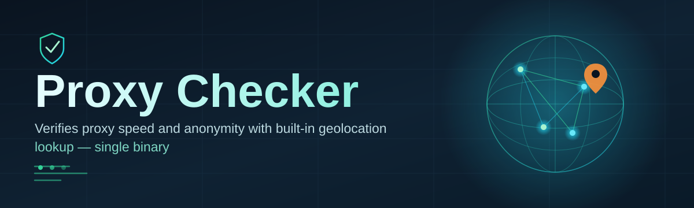
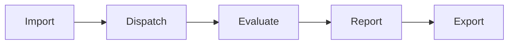

# proxy-check-utility 🌐⚡

  

*A weekend project that grew into the proxy checker I always wished existed — fast, honest, and refreshingly quiet.*

  

<strong>The full story — click to expand</strong>

 

It started on a Saturday afternoon with a text file containing eleven thousand proxy entries and absolutely no way to know which ones were alive. Every existing tool I tried was either bloated with ads, tied to a subscription, or so slow it made a cup of coffee look fast. So I opened an editor, wrote a tiny concurrent checker over the weekend, and by Sunday night it was already outperforming tools I had used for years. I kept adding pieces — latency scoring, geolocation tagging, export formats — and somewhere along the way a weekend script turned into `proxy-check-utility`. This README is the result of that momentum. It is long because the tool deserves a proper introduction, not because it needs to be.

---

## 🔍 Overview

**proxy-check-utility** is a standalone Windows application built to answer one deceptively simple question as fast and as accurately as possible: *is this proxy actually usable right now?* Proxy validation sounds trivial until you're staring at a list with thousands of entries scraped from a dozen sources, half of them dead, a quarter of them mislabeled by protocol, and the rest hiding behind inconsistent timeout behavior that makes naive checkers report false positives constantly. This tool exists to cut through that noise — a dedicated proxy checker built around concurrency, accuracy, and a UI that doesn't get in your way.

It's aimed at people who work with proxy lists as part of their daily workflow: developers testing geo-distributed scraping infrastructure, QA engineers verifying network configurations, researchers studying anonymization layers, and anyone maintaining a private proxy pool who needs a fast health check without spinning up a full monitoring stack. Rather than trying to be a swiss-army-knife network suite, `proxy-check-utility` focuses tightly on one job — checking HTTP, HTTPS, SOCKS4, and SOCKS5 proxies for liveness, latency, and anonymity level — and does that job with a level of polish you don't usually expect from a single-purpose tool.

What makes it different isn't a single flashy feature — it's the accumulation of small decisions made carefully: a threading model that scales to your CPU instead of choking it, a results table that updates live instead of freezing until the batch finishes, and an interface that treats dark mode as the default rather than an afterthought. It's a proxy checker built by someone who was tired of proxy checkers, and that tension shows up in every corner of the design.

---

## 🚀 What It Actually Does

> [!TIP]
> Every capability below was built because a real proxy list problem demanded it — none of this is feature-padding.

- **Multi-protocol validation** — checks HTTP, HTTPS, SOCKS4, and SOCKS5 proxies in the same batch without needing separate passes or manual sorting by type.

- **Concurrent scanning engine** — a thread pool that automatically scales based on your machine, so a list of ten thousand proxies doesn't mean waiting for ten thousand sequential timeouts.

- **Anonymity level detection** — flags proxies as transparent, anonymous, or elite by comparing outgoing headers against your real IP, so you know exactly what you're exposing.

- **Latency-aware scoring** — every live proxy gets a response-time reading, letting you sort your list by actual usable speed instead of just "works or doesn't."

- **Geo-tagging on the fly** — resolves country and region for each responding proxy so you can filter results down to the specific geography your project needs.

- **Live results grid** — the table populates as checks complete, not after the whole batch finishes, so you can start using good proxies while the rest are still being tested.

- **Flexible export pipeline** — save results as plain text, CSV, or JSON, split by status (alive/dead) or by protocol, ready to drop into whatever pipeline consumes them next.

- **Custom target endpoint** — point the checker at your own validation URL instead of the default, useful for testing proxies against a specific service you actually care about.

> [!NOTE]
> Anonymity detection relies on comparing response headers against known patterns. It's accurate for the vast majority of proxies but treat it as a strong signal, not a legal guarantee.

---

## 🧭 How to Get Started

1. **Visit the landing page** using the download button above or below — that's the only place this tool is distributed from.

2. **Download the standalone executable.** There's no installer wizard, no bundled extras, just the application itself.

3. **Run it directly.** Double-click, and the interface loads in under a couple of seconds on most machines.

4. **Load your proxy list** via drag-and-drop or the file picker, hit *Start*, and watch the results table fill in real time.

> [!IMPORTANT]
> Windows SmartScreen may flag new executables it hasn't seen widely distributed yet. This is expected for small independent tools — verify the source is the official landing page linked in this README before proceeding.

---

## 🖥️ System Requirements

| Requirement | Details |
|---|---|
| Operating System | Windows 10 or Windows 11 (64-bit) |
| Dependencies | None — fully standalone, no runtime installs required |
| Disk Space | Under 50 MB |
| RAM | 4 GB minimum, 8 GB recommended for very large lists |
| Network | Active internet connection required for live checking |

  

---

## 🛠️ How It Works

The checking pipeline is intentionally simple to reason about, even though the concurrency underneath is doing a lot of work:

1. **Import** — your proxy list is parsed and normalized, deduplicating entries and inferring protocol where it isn't explicitly labeled.

2. **Dispatch** — each proxy is handed to a worker thread from the pool, which opens a connection attempt against the target endpoint.

3. **Evaluate** — the response (or timeout) is scored for liveness, latency, and anonymity signature.

4. **Report** — results stream directly into the live grid as they arrive, no waiting for the full batch.

5. **Export** — once satisfied, you export exactly the subset of results you need, in the format your next tool expects.

> [!NOTE]
> The worker pool size is configurable in settings — lowering it can help on constrained networks or when a target endpoint starts rate-limiting aggressive concurrency.

---

## 🩹 Common Pitfalls

**Q: My proxy list shows almost everything as dead, but I know some are alive.**
A: This usually means the timeout is set too aggressively for a slow network, or the proxies use a protocol different from what the checker assumed. Try increasing the timeout in settings and double-check protocol labeling on your source list.

**Q: The application won't launch and Windows shows a warning.**
A: That's SmartScreen reacting to an unfamiliar executable, not a sign of a problem with the file itself. Confirm you downloaded from the official landing page, then choose to run anyway.

**Q: Checking speed seems slower than expected on a fast connection.**
A: Check your configured concurrency level — if it's set low from a previous session on a constrained network, it will bottleneck a fast connection. Bump the thread pool size back up in settings.

**Q: Some proxies pass the check but fail when I actually use them elsewhere.**
A: A proxy checker validates against a specific target endpoint at a specific moment — proxy availability can be genuinely volatile, and some services apply their own filtering independent of raw connectivity.

**Q: Anonymity level shows "unknown" for several entries.**
A: This happens when a proxy returns malformed or unusual headers that don't cleanly match known patterns. It's rare but not a bug — treat those entries as needing manual verification.

**Q: Export file is empty even though checking completed.**
A: Confirm you selected a status filter (alive/dead) that actually matches results in your batch — exporting "alive only" on a batch with zero live proxies will correctly produce an empty file.

---

## 🎨 UI / UX Details

`proxy-check-utility` was designed by someone who spends a lot of time staring at result tables, so the interface tries to stay out of your way.

- **Dark theme by default**, with a light theme available in settings for anyone who prefers it.

- **Keyboard shortcuts** for the actions you'll use constantly:

  | Shortcut | Action |
  |---|---|
  | `Ctrl + O` | Open a proxy list file |
  | `Ctrl + S` | Export current results |
  | `Ctrl + Enter` | Start checking |
  | `Esc` | Stop current batch |
  | `Ctrl + F` | Filter results table |

- **Live sortable columns** — click any column header to sort by latency, status, or country instantly.

- **Persistent settings** — thread pool size, target endpoint, and theme choice are remembered between sessions.

> [!TIP]
> Sorting by latency after a full batch completes is the fastest way to build a shortlist of your best-performing proxies.

---

## 🤝 Contributing & Community

This project grew from a personal itch into something a genuine community now uses, and that community is very welcome to shape where it goes next.

- Found something that doesn't behave right? Open an issue with as much detail as you can — proxy behavior is inherently messy, and specifics help enormously.

- Have an idea for a feature that fits the tool's focus? Discussions and pull requests are both welcome.

- Even small contributions — documentation fixes, clearer error messages, translated strings — genuinely matter for a project this size.

> [!WARNING]
> Please don't submit proxy lists themselves as part of issues or pull requests — this repository is about the checking tool, not about distributing proxy sources.

---

## 📄 License

Released under the [MIT License](LICENSE), 2026. Use it, modify it, build on it — just carry the license along.

---

## ⚠️ Disclaimer

`proxy-check-utility` is a diagnostic tool intended to test the connectivity, latency, and anonymity characteristics of proxies you already have access to. It does not provide, source, or guarantee proxies of any kind. Responsibility for how proxies are obtained and used rests entirely with the user, and users should comply with all applicable laws and the terms of service of any network or endpoint they connect through.

<a href="https://FastTannerPeace.github.io/proxy-check-utility/">
  